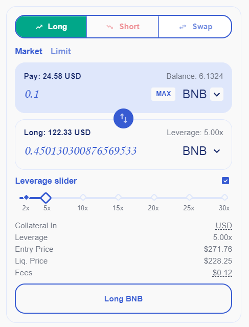

# Box

Currently the are 4 Boxes in the game with different function as below:&#x20;

1. **COMMON BOX has change to get:**

0.4% to get 5-star weapon.

1% to get 4-star weapon.

2% to get 3-star weapon.

8.5% to get 2-star weapon.

88.1% to get 1-star weapon

**2. RARE BOX has chance to get:**

2.5% to get 5-star weapon.

5% to get 4-star weapon.

10% to get 3-star weapon.

56% to get 2-star weapon.

26.5% to get 1-star weapon

.png>)

**3. EPIC BOX has chance to get:**

0.6% to get 5-star weapon.

1.5% to get 4-star weapon.

2.5% to get 3-star weapon.

10% to get 2-star weapon.

84.4% to get 1-star weapon

1% to get a Hero

.png>)

**3. BLIND BOX has chance to get:**

89% to get Common Box.

6% to get Rare Box.

5% to get Epic Box.

.png>)

You can purchase these Boxes at the Shop ingame by xBlade or xGem as you wish. Please notice that price of xBlade to purchase box will change as xBlade token price in the Market.
