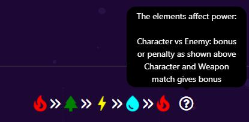

# Elements

Gamers in CryptoWar are empowered with weapon elements such as:

• Fire

• Earth

• Lightning

• Water

Elements are an important factor as the odd of winning or losing in each battle mainly depends on their vantage usage by gamers. Each element trumps and is trumped by another element, as follows:

• Fire o Trumps Earth o Trumped by Water

• Earth o Trumps Lightning o Trumped by Fire

• Lightning o Trumps Water o Trumped by Earth

• Water o Trumps Fire o Trumped by Lightning

