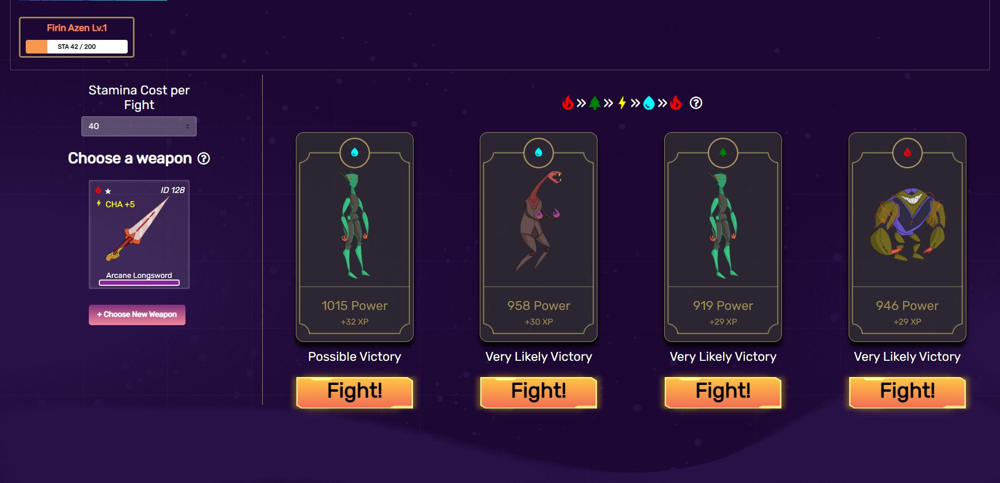

# Combat Formula

## Combat Variables

CryptoWar combat utilizes a number of variables calculated from the player’s NFT data which are outlined as follows:

* **Unaligned Character Power** is calibrated by using the existing level of the character and the chosen weapon excluding elemental matching.
* **Aligned Character Power** employs the same formula as mentioned above with the exception that it takes heed of the compatibility between the character’s element and its attributes, or if that attribute is PWR
* **Trait Bonus** is determined on the basis of comparing character element to its chosen enemy element so that strong, neutral or weak attribute can be known.
* **Enemy Power** is known as power value of the selected enemy, which is used in determining the combat roll and the prize payout.

Numerous presumptions about CryptoWar combat can be brought out for further discussion based on the preceding information

## Elemental Matching

There marks the three profound significances to elemental matching including choosing an enemy with lower-level element, comparing a weapon’s element to your character and comparing a weapon’s attributes to that of yours

We can put out various paramount statements based on the combat formulas.

* Matching elements are important for chances of winning and calculations of gamers’ experience enrichment.
* Matching elements are NOT critical for calculating enemy power range.
* Matching elements are NOT essential for calculating Xweapon payout.

## Formulas

Combat begins by determining the **Unaligned Character Power**, which is then employed to ponder your enemy options.

Further information on the formula and other variables are given below:


[calculating-player-power.md](calculating-player-power.md)


After determining the **Unaligned Character Power** the game automatically multiplies that figure by 20% to evaluate the possible strengths of your enemy.


The ±20% implies that you might encounter difficulties in winning the battle without having elemental matching at your vantage so that you will never face an enemy that is impossible to defeat.


After that, the player moves on to the next step of selecting enemy and verifying the transaction. Player’s **Aligned Character Power** and **Trait Bonus** is calculated by the contract, which is later used for measuring player’s combat roll and experience gained on victory.

The player's roll is calculated by multiplying **Aligned Character Power** with **Trait Bonus** and applying a ±20%.

The enemy's roll is calculated by multiplying listed power value by ±20%.

The player wins the fight if his or her roll is equal to or higher than the enemy’s roll. Then Experience and xBlade payouts can then be calculated.

An overview of the formulas for calculation results can be found here:


[combat-rewards.md](combat-rewards.md)

