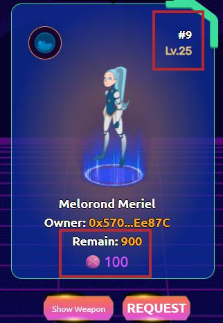

# Career Mode as Attacker

First select your Hero and Weapon here, no need to fill up Amount of Match and Total deposit

.jpg>)

Select your opponent at " Career Mode " tab and click " Fight " then wait for result:

.jpg>)

Here some information you should notice : Level's opponent, amount of match bet , number of Xblade remain and what weapon do they use ?

You can check out status all of your Fight's Request at " My Request " tab.

