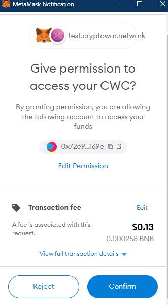
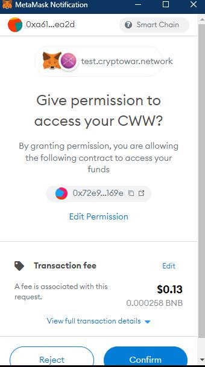

# Career Mode as Defender

First, select your Hero and Weapon you want to place on the ring. Put in amount of match and total deposit you want to bet. Please remember that Total Deposit is at least = 210% Amount a match. For Ex : Amount of match is 10 xBlade so Total Deposit is 21 xBlade or more.

.jpg>)

Then Approve Permission to Access your Hero ( CWC )and Weapon ( CWW ) for Metamask. Please notice that every Heroes and Weapons need to be approved permission for the first time listing. For Ex : you have 2 Heroes and 2 Weapon want to list to Career Mode, you have to approve 4 transactions for the first time and that's it, no need to do it again.

.jpg>)

After that you will find the Hero that you listed at " My Career Mode " tab. You only can " Cancel Fight " after 1 hour. And please know that the Hero is on the ring list will not be able to play other mode, such as PvE. After you 'Cancel Career' in PvP mode, your selected Hero will be able to use for fighting in PvE again, immediately

.jpg>)

You can check out other's request to fight at " Request to Challenge " tab. Remember to check out your opponent's power and what kind of weapon that they use, Fight if you see chance to win or just leave it there if you don't. You can not cancel other's fight request !

Once you accept the request and pay gas fee then wait for fight's result : Win or Lose

 (1).jpg>)

