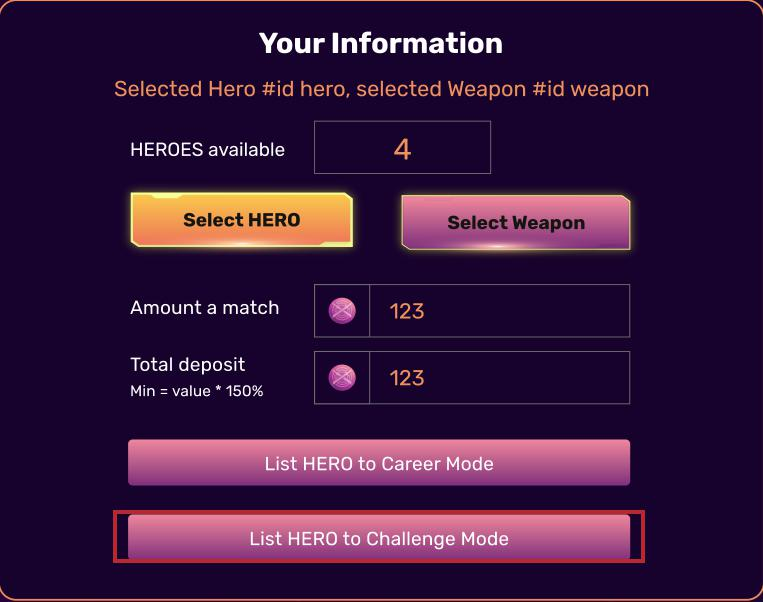

# Challenge Mode as Defender ( coming soon )

First, select Hero and Weapon you want to place on the ring

Then click " List HERO to Challenge Mode " . You do not need to put in amount a match and total deposit in this case.

You will find your Hero on Challenge Mode tab as below:

.jpg>)

Now wait for battle request and Fight or Reject as you prefer :

.jpg>)

