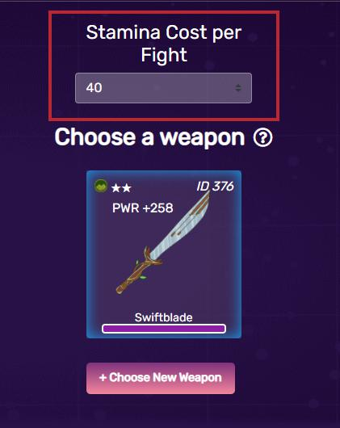
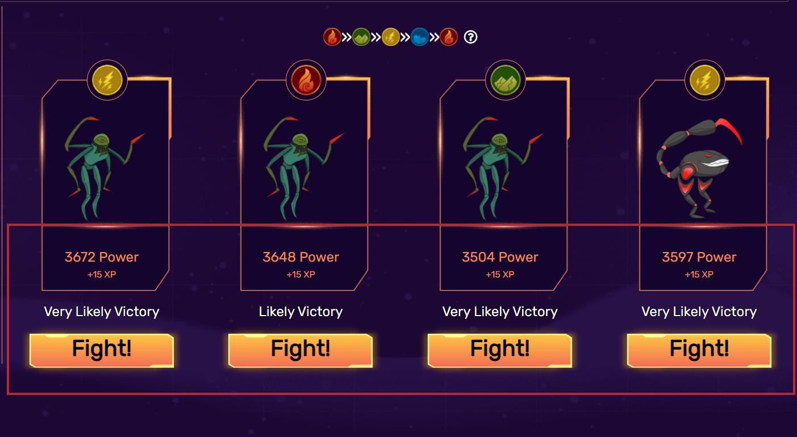

# Fights

## How much stamina to spend?

While consuming more stamina means you can win the fight faster, the returning rewards are the same when factoring in the gas fee and the average payout becomes smaller in the long run if players lose their fights.

However, if you are playing on multiple accounts with a sizeable budget in gas BNB, higher stamina consumption can save you a lot of time and gas, provided that you can win most of your fights.

## Choosing Monsters

The range of enemies you are able to fight are randomized but still follow an undisclosed formula based on your character and weapon. As a result, it is possible for you to defeat the whole batch or nothing at all since account elements are not in this formula. Thus, you can greatly increase your win rate by choosing a monster with an element that your characters and weapons have an advantage against. It is not advised to picked those that have an advantage against your elements as it is more likely that you would suffer a loss.


In case your stamina is about to be physically drained and players don’t get the upper hand of element trump, they are advocated to go into battles with enemies of other elements. Bonus or penalty will not be exercised if players fight with the same enemies or enemies with different elements. Besides, it is suggested that players should not engage in battles where they are at a disadvantage.


## &#x20;Refresh Monster List

You may get unlucky sometimes and get a batch full of monsters that you have no elemental advantage against. If you still have stamina, it is advised that you wait for a new randomized batch, which occur every 2 hours at UTC+0.

To prevent EVM errors, all players will be unable to start a fight in the final 30 seconds of each hour. During this 30-second period, players should wait for the hourly fresh and not start any fight as missing monsters may cause transaction errors.

## High Power and Low Power

Monsters' power experiences a fluctuation of ±20% of the predicted value. For that reason, there is a lot of variation, especially as players’ character levels rise.

The choice to target a high-powered enemy against a low-powered enemy boils down to choosing payout over win rate.

Battling with high-powered enemies may possibly run the risk of failing the game but increase the chance of acquiring more experience as well as xBlade payout and vice versa. New players are highly recommended to select lower-powered enemies so as to maintain their xBlade payout and experience points.
