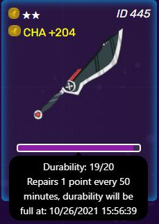
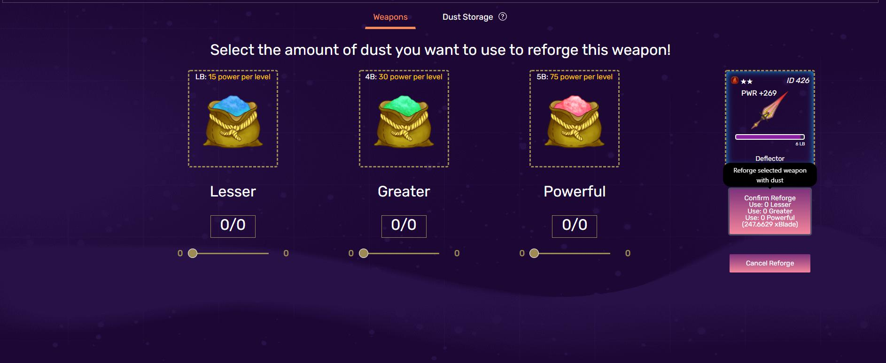

# Weapons

.jpg>)

It goes without saying that weapons are an essential pillar of NFTs. To get engaged in the game, players are required to possess their own weapons which can be fully utilized for in-game transactions such as trading, obtaining xBlade and earning money. What differentiates the weapons from characters is the unbounded number of weapons in each account.

To keep weapon-minting-price under surveillance, please press on the “Forge” button in the Blacksmith tab for further information.

It is worth noting that each weapon is assigned a random element and a random rarity, which is denoted by the number of stars shown on the weapon. The number of attributes along with the values rolled by these attributes is calibrated by the rarity of the weapon. Each weapon can be fully harnessed by all four of players’ characters and is not bound to a particular character. For that reason, forming a strong squad owning similar element appears to be an effective strategy to optimize the strength of the weapon.

For the time being, there is no method to adjust any of the weapon’s values.

## CWW - CryptoWar Weapon

CWW stands for CryptoWar Weapon which is the weapon NFTs existing in your wallet.

If you want your CWC to be visible to your MetaMask wallet, you may add the token through its contract address found below:

> 0x52683412f6Ea2B6302ceA8406EfF928510466c2c


Set the decimal to "0" if prompted.


## Weapon Durability

Durability refers to the amount of time that players can shoot an enemy with a weapon meaning that each weapon owns a certain durability to cut down the amount of time spending on each weapon, halting taking advantage of that weapon by passing it around as well. That is the reason what a weapon needs to be cooled down after each battle.

Due to the fact that its recovery speed is on a par with character stamina, durability empowers each account to fight four characters with the same weapon. What is more, durability has no impact on the win-rate or the function of each weapon when battling.

## Weapon Minting (Forging)

Along with Reforging, minting weapons is the game’s primary xBlade sink. All xBlade expending on minting weapons is transferred directly to the contract handling fight payouts.

There is no commitment that the weapon rarity is fetched by the certain amount of rolls. The harder each player tries the more they achieve.

Weapon rarity is determined based on minting weapons. Further information on the rates of each rarity is elucidated at [forging](broken-reference).

## Weapon Elements

.jpg>)

Element is picked out through minting weapon. Each weapon comes as one of four distinct elements, which is basically similar to characters.(Fire, Earth, Air, Water).

The element of the weapon is used for calculating the player roll for combat.

More information on element matching can be found here:


[fighting](../fighting/)

