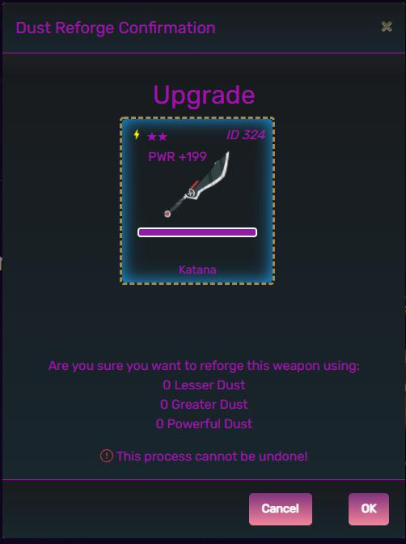
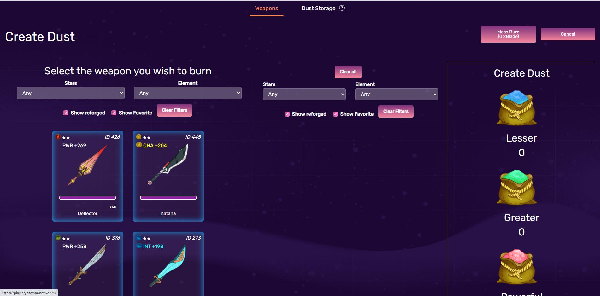
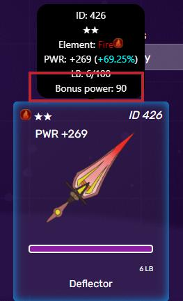

# Reforging

Reforging weapons refers to the action of expanding xBlade tokens to burn a weapon into another, which eventually results in the disappearance of burnt weapon and an increase in the bonus power of target weapon. Along with Forging, reforging weapon is supposed to be one of the game’s primary xBlade sinks. When endeavoring to forge four or five-star weapons, players often acquire one or three-star weapons, which are fully employed in the reforging process to add a massive amounts of value to one of players’ preferred weapons.

## LB, 4B, and 5B

A forged weapon contains new information of its attribute about what it is forged into which is symbolized as LB, 4B and 5B

LB stands for _Low Star Burn_ and is the total value of one to three-star weapons burnt.

4B stands for _Four Star Burn_ and is the total value of four-star weapons burnt.

5B stands for _Five Star Burn_ and is the total value of five star weapons burnt.

## Bonus Power

Bonus Power is a new stat acquired after reforging a weapon, which is utilized in conjunction with weapon attributes to calibrate player power in combat rolls.

More information on how Bonus Power is used can be found here:


[fighting](../fighting/)


## Burn Value

The burnt weapon rarity decides which of the following burn pool the value should go for. The maximum threshold limits for LB, 4B and 5B is not contingent on one another. The higher weapon rarity is the more Bonus Power players yield.

The maximum amount of burn points and the bonus power per point acquired are shown in the following table:

| Burnt Weapon Rarity    | Pool | Maximum Pool Value | Bonus Power Per Point | Maximum Bonus Power |
| ---------------------- | ---- | ------------------ | --------------------- | ------------------- |
| 1-star, 2-star, 3-star | LB   | 100                | 15                    | 1500                |
| 4-star                 | 4B   | 25                 | 30                    | 750                 |
| 5-star                 | 5B   | 10                 | 60                    | 600                 |

This means that a fully reforged weapon can have a maximum of 2850 bonus power.

## Burn Conditions

The amount increased per burn can be changeable dependent on weapon rarity and the current value of the pool.

Below is the statistics on how much the pool increases after burning individual weapon rarity.

* 1-star weapon burns increases LB by one
* 2-star weapon burns increases LB by two.
* 3-star weapon burns increases LB by three.
* 4-star weapon burns always increases 4B by one.
* 5-star weapon burns always increases 5B by one.

## Carryover Value

Half of the burnt weapon’s LB, 4B and 5B will be transferred to new weapon when players employ reforged weapon as a burnt weapon.

The number is rounded to zero decimal places in case of dividing an odd numbered LB, 4B and 5B.


A weapon with 50 LB will transfer 25 LB when used as a burn weapon.

A weapon with 55 LB will transfer 27 LB when used as a burn weapon.

