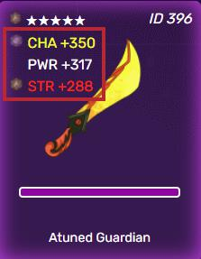
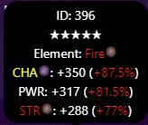

# Weapon Attributes

Weapon attributes are different stats enlisted below particular weapon, that are administered in sync with character power for fixing player’s combat activities.

Every attribute is laced with pair of elements and their corresponding associated number.



## Attribute Count

The table below contains information about the amount of attributes of particular weapon, which is calibrated by weapon rarity.

| Weapon Rarity          | Number of Attributes |
| ---------------------- | -------------------- |
| 1-star, 2-star, 3-star | 1                    |
| 4-star                 | 2                    |
| 5-star                 | 3                    |

## Attribute Element

There are five distinct types of attributes, four of which has a specific element pairing and one of which is neutral. Below is detailed information about element pairings for your reference:

| Attribute Name | Element Pairing |
| -------------- | --------------- |
| STR            | Fire            |
| DEX            | Earth           |
| CHA            | Lightning       |
| INT            | Water           |
| PWR            | Neutral         |

The odds of winning while employing that weapon in combat lie in presence of better pairing attributes and character element. Further information about combat calculation can be discovered here:


[fighting](../fighting/)


## Attribute Value

Each attribute has a corresponding numerical value recognized by the weapon rarity and randomized by minimum and maximum roll. Stat values are enumerated in the under-mentioned table:

| Weapon Rarity | Minimum Roll | Maximum Roll |
| ------------- | ------------ | ------------ |
| 1-star        | 4            | 200          |
| 2-star        | 180          | 300          |
| 3-star        | 200          | 400          |
| 4-star        | 268          | 400          |
| 5-star        | 280          | 400          |

Attribute values along with character stats are fully utilized to indicate that total attribute values combined with character power is employed to determine target power ranges in each combat. Aside from that, total attribute values, attribute elements and character power as well are used to measure the rolls each players might possess when engaging in a combat.

More information on combat calculations can be found here:


[fighting](../fighting/)



Below are adequate explanations about the Displayed Percentages, which turn out to be quite beneficial for players at average level in terms of evaluating the strength of weapons.


## Displayed Percentages



Players can be notified of the percentage value next to each attribute while selecting a character. These percentages are used to assess the impact of specific attribute when taking the selected character’s element into account.

Below is the formula for converting percentage to decimal form:

```
if attributeElement != charElement (attributeValue * 0.0025)
if attributeElement == PWR (attributeValue * 0.002575)
if attributeElement == charElement (attributeValue * 0.002675)
```

Given the abovementioned formula, for a paired attribute with a value of 400, the maximum fixed percentage would be 107%.


It proves to be fairly easy to compute fixed percentages while checking over the weapon with the character to be used as a means to evaluate the value of a weapon.

The higher total percentage corresponds to higher payout players collect on each victory.

Attribute element remains to be harshly critical to win rate. Nevertheless, this can be resolved by methodically choosing its enemy.

