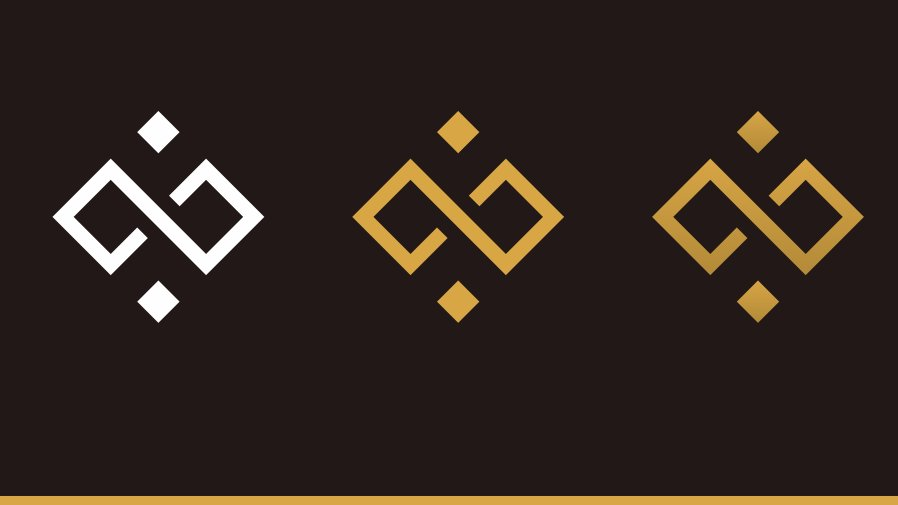

# Backers & Partners

## Backers&#x20;

[XBN.Finance](https://xbn.finance) aims to power the next big things on Ethereum Virtual Machine Networks. XBN works as an engine: innovate and build ideas and technologies that create wealth for XBN token holders. When an investor buys XBN and becomes an XBN token holder, the investor acquires a piece of a team that is dedicated to seek the next big ideas and build those technologies in the crypto space to create wealth for her.

[Cloudjet Solutions](https://www.cloudjetsolutions.com) (CJS) is a Cloud Computing & Software as a Service company based on Singapore and invested by [Expara Venture Fund](https://www.expara.com). After 10 years of development, CJS has wide-range clients from Big Corp to Small Enteprise around Vietnam.&#x20;

[Altair Alpha](https://altair-alpha.com) is a Keiretsu Forum's angel-back holding company that is active in tech and industrials. Altair Alpha runs million dollars supply chain management value across various industries from hardwood lumber to paper recycling. Altair Alpha partners include veteran decision makers from JP Morgan, BakerHostetler, HP, VI Group, and Cloudjet Solutions.

[Altair Cliff Associates LLC](https://www.altair-cliff.com) is an investment firm following global macro strategy.  Altair Cliff Associates is active in US Equity, Options, Cryptocurrencies, and Private Placement.

## Partners 

[ccFOUND](https://ccfound.com) is a project from Poland. It solves (uberizes) the problem of knowledge and wisdom search similarly to Google – by polling the network – however not of computers, but of other people’s minds. As the only one of aforementioned portals, it monetizes knowledge in a multi-faceted manner and helps people who specialize in a given subject to earn money on it. It allows asking paid questions; inserting paywalls in published responses, news, and analyzes; publishing paid e-books, online courses, webinars, and reports; organizing events, trainings, and conferences; collecting patrons and donors with access to closed groups and communities

Description for website Portal to cryptocurrency destination, [Quarashi Network](https://quarashi.network) fosters adoption through [it’s mobile application](https://play.google.com/store/apps/details?id=com.ibt.quarashi) dedicated to crypto users, both beginner and advanced. Developing a cryptocurrency ecosystem for end-users as platform modules use leverage cutting edge technology, combined with synergy between multiple strategies. The platform consists out of 6 modules: Multi Chain Non Custodial Wallet supporting +9000 cryptocurrencies, Decentralized Exchange, 100% Private Messaging Module, VPN and Incognito Browser, IDO Launchpad, Airdrops & News & Top ICO module.

OwlDAO aims to build the best casino solution for Web 3.0. Partnering with leading protocols, the OWL token provides perpetual buyback from casino incomes, plus auto-liquidity and staking rewards.

Owl.Games : Best Crypto Casino for Web 3.0

[SandBoxcasino.io](https://sandboxcasino.io) is a hybrid casino which provides traditional crypto deposits alongside the newly popularized: web3.0 wallet connectivity and an ability to add any coins and networks. Sandbox also features an NFT gallery and a NFT section for all its users to see and win on their monthly giveaways. This casino is definitely the next big thing.

[HyperJump](https://hyperjump.app) is a multi-chain Defi platform focused on optimizing and grouping the main DApps most used by users in a single interface
