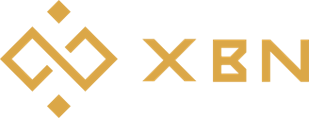

# Backers & Partners

## Backers

.jpg>)

[Harmony ](https://www.harmony.one/)is an open and fast layer-1 blockchain: Harmony mainnet runs Ethereum applications with 2-second transaction finality and 100 times lower fees.

[Cloudjet Solutions](https://www.cloudjetsolutions.com) (CJS) is a Cloud Computing & Software as a Service company based on Singapore and invested by [Expara Venture Fund](https://www.expara.com). After 10 years of development, CJS has wide-range clients from Big Corp to Small Enteprise around Vietnam.

[Altair Alpha](https://altair-alpha.com) is a Keiretsu Forum's angel-back holding company that is active in tech and industrials. Altair Alpha runs million dollars supply chain management value across various industries from hardwood lumber to paper recycling. Altair Alpha partners include veteran decision makers from JP Morgan, BakerHostetler, HP, VI Group, and Cloudjet Solutions.

[Altair Cliff Associates LLC](https://www.altair-cliff.com) is an investment firm following global macro strategy. Altair Cliff Associates is active in US Equity, Options, Cryptocurrencies, and Private Placement.

[XBN.finance](https://xbn.finance/) aims to power the next big things on Ethereum Virtual Machine Networks. XBN works as an engine: innovate and build ideas and technologies that create wealth for XBN token holders. When an investor buys XBN and becomes an XBN token holder, the investor acquires a piece of a team that is dedicated to seek the next big ideas and build those technologies in the crypto space to create wealth for the investor.

## Partners 

[ccFOUND](https://ccfound.com) is a project from Poland. It solves (uberizes) the problem of knowledge and wisdom search similarly to Google – by polling the network – however not of computers, but of other people’s minds. As the only one of aforementioned portals, it monetizes knowledge in a multi-faceted manner and helps people who specialize in a given subject to earn money on it. It allows asking paid questions; inserting paywalls in published responses, news, and analyzes; publishing paid e-books, online courses, webinars, and reports; organizing events, trainings, and conferences; collecting patrons and donors with access to closed groups and communities

Description for website Portal to cryptocurrency destination, [Quarashi Network](https://quarashi.network) fosters adoption through [it’s mobile application](https://play.google.com/store/apps/details?id=com.ibt.quarashi) dedicated to crypto users, both beginner and advanced. Developing a cryptocurrency ecosystem for end-users as platform modules use leverage cutting edge technology, combined with synergy between multiple strategies. The platform consists out of 6 modules: Multi Chain Non Custodial Wallet supporting +9000 cryptocurrencies, Decentralized Exchange, 100% Private Messaging Module, VPN and Incognito Browser, IDO Launchpad, Airdrops & News & Top ICO module.

[OwlDAO ](https://owldao.io/)aims to build the best casino solution for Web 3.0. Partnering with leading protocols, the OWL token provides perpetual buyback from casino incomes, plus auto-liquidity and staking rewards.

[Owl.Games](https://www.owl.games/) : Best Crypto Casino for Web 3.0

[SandBoxcasino.io](https://sandboxcasino.io) is a hybrid casino which provides traditional crypto deposits alongside the newly popularized: web3.0 wallet connectivity and an ability to add any coins and networks. Sandbox also features an NFT gallery and a NFT section for all its users to see and win on their monthly giveaways. This casino is definitely the next big thing.

[HyperJump](https://hyperjump.app) is a multi-chain Defi platform focused on optimizing and grouping the main DApps most used by users in a single interface

.png>)

[TribeOne](https://www.tribeone.io/) is the world’s first-ever NFT lending platform that offers a seamless experience; to the users through its innovative consumer-centric products. The platform will break barriers in the traditional financial ecosystem and revolutionize the DeFi sphere as a whole. Providing the community with a platform to lend, borrow and invest in NFTs. Therefore, offering an unconventional experience for all.

.png>)

[Formless](https://www.formless.me/home) is the world's first and leading GameFi and Metaverse aggregator connecting games, gamers and guilds. We will become the 'Steam of GameFi', bringing Play-to-Earn gaming into the mainstream by making blockchain gaming more accessible through improving user experience, integrating tools and services and simplifying existing industry processes. Formless is well-positioned to lead the success of the GameFi and Metaverse revolution and support the growth of the GameFi industry through our feature-rich Web3.0 platform, being already partnered with over 200 blockchain games, 50 guilds and a large range of strategic partners.

[CoverCompared](https://covercompared.com/) is a frictionless marketplace that offers a plethora of traditional as well as crypto-based insurance policies which can be purchased in exchange for cryptocurrencies. Our vision is to align insurance purchases with the core principles of decentralized technology to provide global access to everyone while offering a censorship-resistant platform and build a open-source technology governed by software and controlled by its users.

.png>)

[AlphaBatem ](https://alphabatem.com/)is a metaverse infrastructure company focused on enabling the next generation of metaverses. It provides various services, including our own Metaverse Drag & Drop builder, which allows a user to build a metaverse and then view it on the Web, Desktop, Mobile, AR & VR. Using our technology, anyone who owns AlphaBatem land can create or import a multiplayer metaverse. AlphaBatem services include large-scale multiplayer engines, on-chain logic engines, on-chain metaverse profiles, on-chain analytics & NFT insights, just to name a few.

.png>)

[PlataOCrypto ](https://plataocrypto.io/)is a brandnew concept, mixing NFTs, crypto casino, role-play and social gambling

.png>)

Mainly aimed at 13-35-year-olds, [YouMeme ](https://youmeme.com)is a state-of-the-art social network designed to deliver joy on demand. Enjoy the latest and funniest memes in the form of images, GIFs and videos! The platform includes a native Meme & GIF editor, special events, a reward system based on a Meme-To-Earn model, a next-gen NFT marketplace, and much more!

.png>)

The crypto wallet, [NOW](https://walletnow.app/) and Forever. It's a non-custodial mobile crypto wallet that does not collect any personal data. It allows users to securely store crypto assets, exchange crypto, choosing from more than 20,000+ trading pairs, and purchase crypto with fiat. In NOW Wallet you can receive and send any tokens on 7 supported networks - Ethereum, Binance Smart Chain, Polygon, Avax C-chain, TRON, Klaytn and Solana. Users can also securely store ETH-based NFTs, connect to dApps on 4 suppoerted network and stake crypto to receive up to 25% of annual income. [ChangeNOW ](https://changenow.io/)Pro users can get even more profit with 0,1% Cashback from each transaction.

[ChangeNOW ](https://changenow.io/)is a non-custodial service created for simple and fast cryptocurrency exchanges. We strive for maximum safety, simplicity, and convenience. We do not store your funds or require any sort of account creation. ChangeNOW has almost 400 coins available for exchange and does not hold any limits; you can exchange as much as you want - account-free, worry-free, faster than light. The fiat option is also available - you can buy cryptocurrency with Visa or MasterCard through our third-party partner.

.png>)

[BitKeep ](https://bitkeep.com/)is a decentralized multi-chain digital wallet, dedicated to providing safe and convenient one-stop digital asset management services to users around the world. Currently, there are nearly 5 million users covering 168 countries. BitKeep has reached ecosystem partnership and strategic partnership with Top 30 public chains like Polygon, Solana, BSC, ETH, HECO, OEC, TRON, Fantom, Wax, IOST, AVAX, zkSync, Terra(Luna) etc. and become the official recommended wallet. With 60+ main chains, 8000+ DAPP and 4,5000+ crypto assets, committed to creating the world's largest entry to decentralized world.

[HYVE](https://app.hyve.works/) is the largest web3 job marketplace. Its decentralized nature facilitates the exchange of goods and services among freelancers and companies across the world.

All payments are escrowed, so money are instantly and securely transferred from one end to another.

There are 3 options available when posting on the platform and you can choose to freelance meaning that you will post your offer, or you can choose to hire someone for a specific task, or for a periodic engagement in the form of a job.
