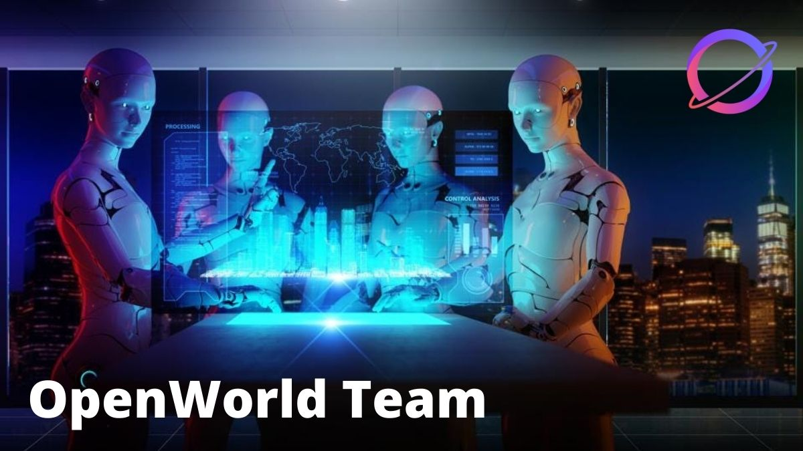

# OpenWorld Team

Cryptowar has 20+ team members in a group of diverse and complemented backgrounds: computer science, venture capital, private equity, digital media, and business operation. The core team knows each other personally and have worked together for 10+ years over various ups and downs in multinational firms as well as high growth funded startups.

We experience first hand short-coming of DeFi and GameFi by projects we built on: DeFi solves the depository issue by offering high yields, however DeFi protocols in the market lack a channel to direct those funds into value creating projects in order to make even higher yields to pay back the depositors. GameFi P2E is a financially unsustainable business model where the value of the gamers’ earnings is mainly financed either by investors or late comers, meanwhile GameFi PvP creates win-lose situation between gamers and is very close to gambling.

However, we also acknowledge the power of blockchain in decentralizing finance and create, for the first time in human history, an authentic and true digital ownership with digital arts and gaming items. Thus, we come up with the idea to build a digital experience, open metaverse, that is enabled by blockchain with a sound circular economy based on real monetary flow. This open digital world will not be a competitive battlefield, but is a collaborative digital value creation space for everyone to connect, play, express themselves, and find happiness.

|                                               |                                                                                                                                              |
| :-------------------------------------------: | -------------------------------------------------------------------------------------------------------------------------------------------- |
|  | 
<strong>James Le / Co-CEO</strong>

+15 years in high tech industry

+6 years in Crypto industry

+3 years in building
 |
|                   | 
<strong>Tri Ton / Co-CEO</strong>

+10 years in Finance

+6 years in Crypto Industry
                                        |
|                   | 
<strong>Tam Nguyen / CTO</strong>

+5 years in Product Development

+3 years in Smart Contract Development
                  |
|                                               |                                                                                                                                              |

#### Work hard. Have Fund. Make History!
