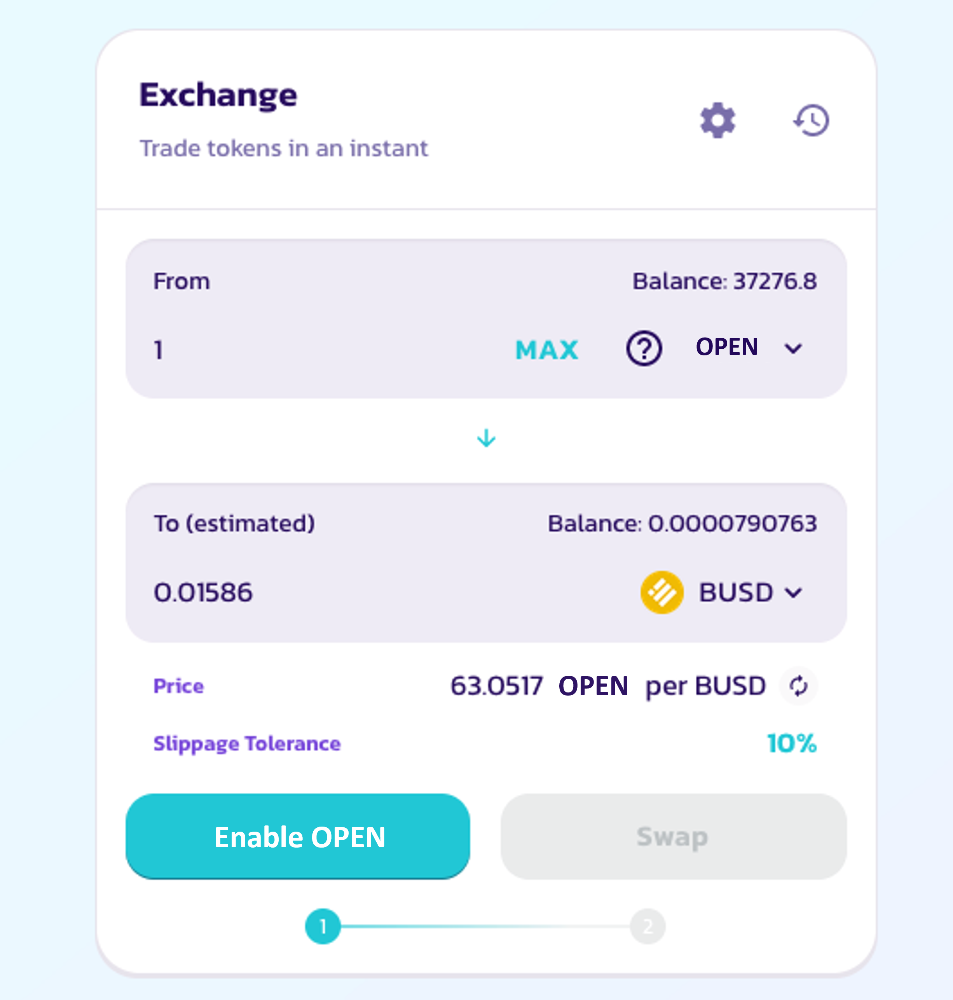

# Oracle

## Purpose

The price oracle imperatively targets to bring the OPEN payout gained by combat as well as minting and reforging fees into line with the current dollar value of OPEN

This indicates that if the dollar value per OPEN rises, the following will happen:

* OPEN payouts falls down
* OPEN required for Mint Characters decreases
* OPEN required for Mint Weapons decreases
* OPEN required for Reforge decreases

In the event that the price of OPEN in dollar falls below a threshold, OPEN payouts and requirements will increase.

The oracle ensures that if players win a majority of their daily fights, they will earn more OPEN which is enough to pay for gas fee costs.

Depending on the changes in the dollar value of OPEN, the Oracle will dynamically adjust fight payouts up or down.

## Reason

The purpose of using Oracle is to withhold the value of in-game currency at a fixed cost. There appears to be a stipulation for the amount of OPEN token circulating in the economy. For that reason, a remarkable increase in the number of users results in an outflow of all OPEN in the contract.

Thanks to the oracle, OpenWorld creates an interrelationship between active users and the currency value of OPEN. Assuming that OPEN price increases, the demand for OPEN will increase, owing to specimen of new game features or an influx of new players.

The oracle empowers the fight transaction fees as well as minting fees for NFTs to be kept at a constant-dollar value, which permits new players to engage in the game with an affordable entrance fees even if the dollar value of OPEN rises.

## Obtaining Oracle OPEN/Dollar Rate

The Oracle follows the current dollar value of OPEN and changes OPEN price accordingly at an undisclosed rate to keep everything fair and unbiased between all players.

OpenWorld is using Pancake Price Feed oracle. To check OPEN price:

* Go to the [PancakeSwap OPEN page](https://pancakeswap.finance/swap?inputCurrency=0x27a339d9b59b21390d7209b78a839868e319301b\&outputCurrency=0xe9e7cea3dedca5984780bafc599bd69add087d56)
* Fill value 1 into OPEN

When the calculated amount is different from the actual dollar value of OPEN, buffs to payouts and mint costs are expected if the Oracle is above the current value of OPEN, and vice versa, nerfs if below.
