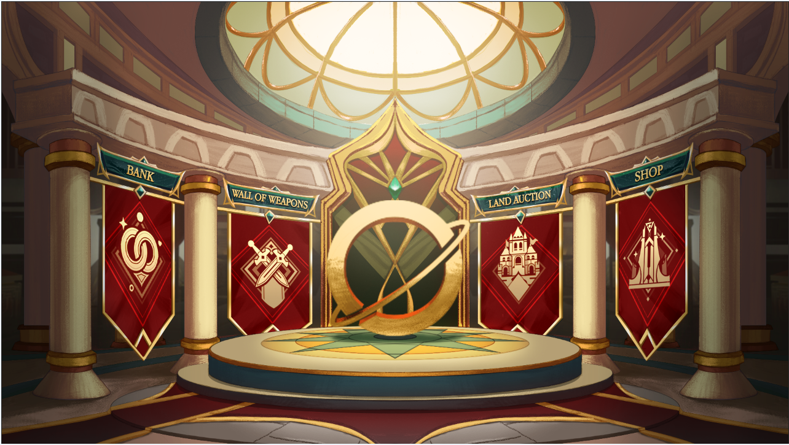
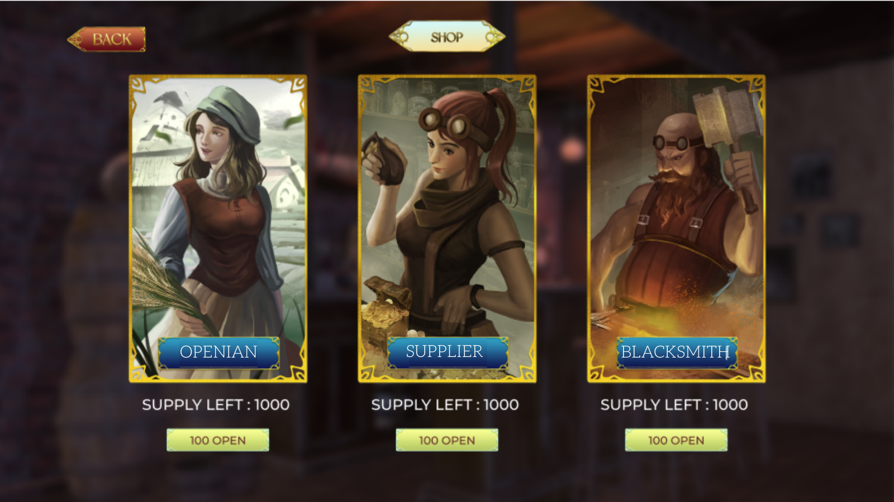

# Castle / Shop

After choosing an appropriate / favorite professsion for Avatar, user must buy relevant NFT which is available at Shop in Castle building.

Each Avatar can own and exchange multiple NFTs but can choose only one profession and this step is Un-doable. In other words, after an Avatar Activates a specific profession, it is unchangeable even if the Avatar meets criteria for other professions.

* Available Openian NFTs: unlimited.
* Available Supplier NFTs: limited with a threshold at 10% of total Avatars currently exist in OpenWorld at a specific point of time.
* Available BlackSmith NFTs: limited with a threshold at 20% of total Avatars currently exist in OpenWorld at a specific point of time.

**How much does each Profession NFT cost?**

* NFT Openian : 5$ in OPEN
* NFT BlackSmith : 250$ in OPEN
* NFT Supplier : 500$ in OPEN

