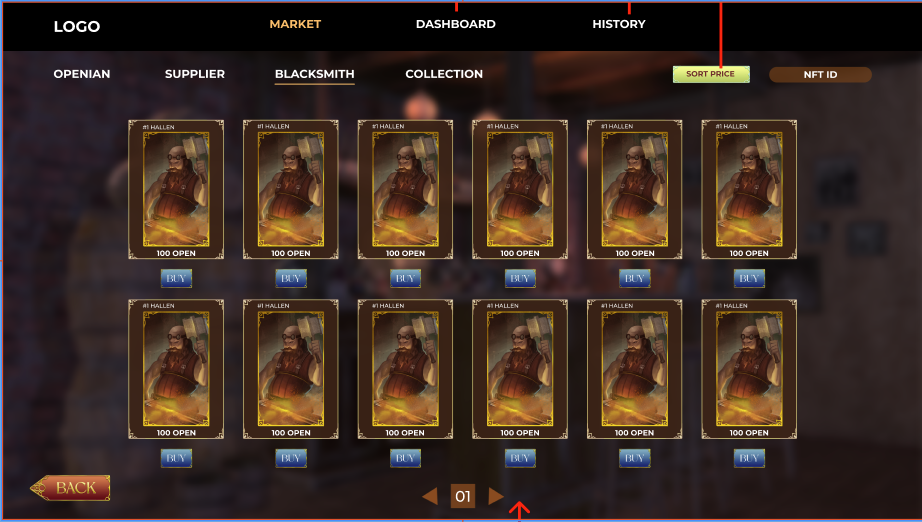
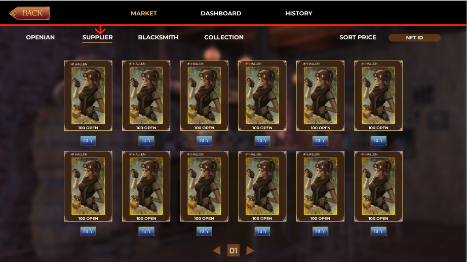
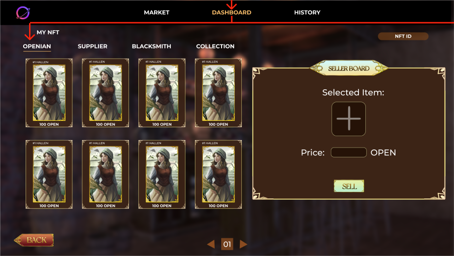
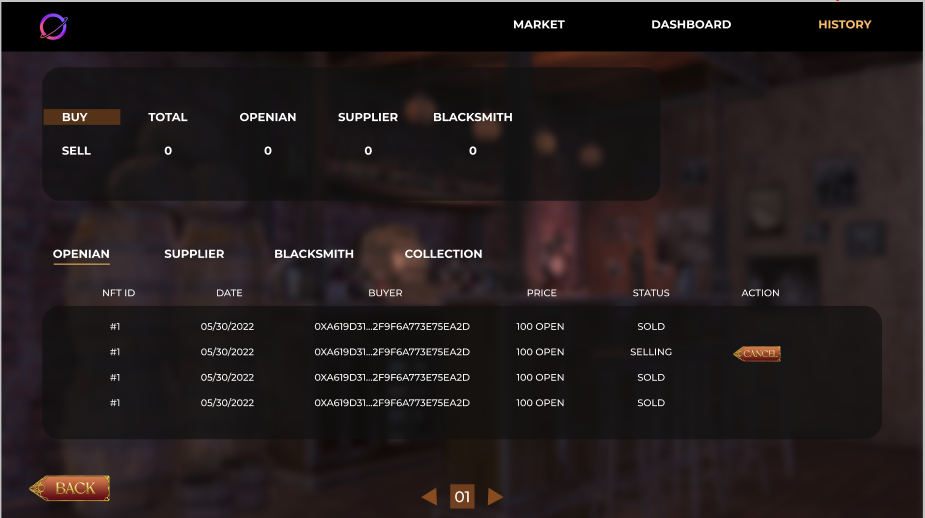

# Marketplace

Now, let’s take a look at OpenWorld Marketplace that is a place for everyone to exchange (trade) their NFTs with three main tabs:

* Market
* Dashboard
* History

Let’s go through functions of each tab

* Market: It displays a list of all NFTs that are available for purchasing on in our Marketplace

Dashboard: It stores all Profession NFTs that are owned by a specific user.

History: It stores all history of selling and buying of a specific user.

