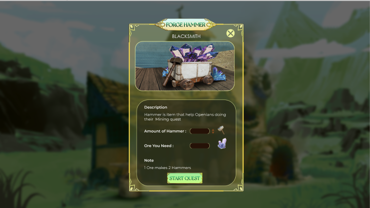

# Blacksmith

**Activation condition**

* Own a BlackSmith NFT
* Have a wallet with ≥ 25.000 OPEN
* Description: a BlackSmith has skills of Hammer forging from Ore

**How to forge Hammer?**

* From 1 Ore, a BlackSmith can forge and make 2 Hammers.
* Ore can be bought from Openian at Workshop
* Waiting time: 0
* Required Stamina: 0
* Tax: 5%

**What is Hammer?**

Hammer is a required item in Mining tasks of Openian. In order to mine and get Ore, Openian must use 1 Hammer per time.

BlackSmith can sell their Hammers at Workshop.

