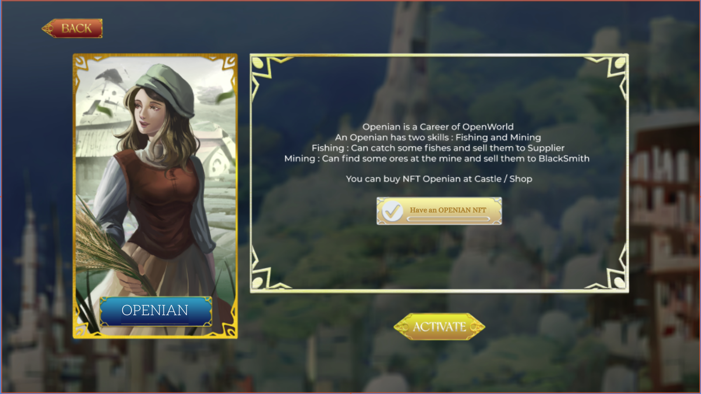
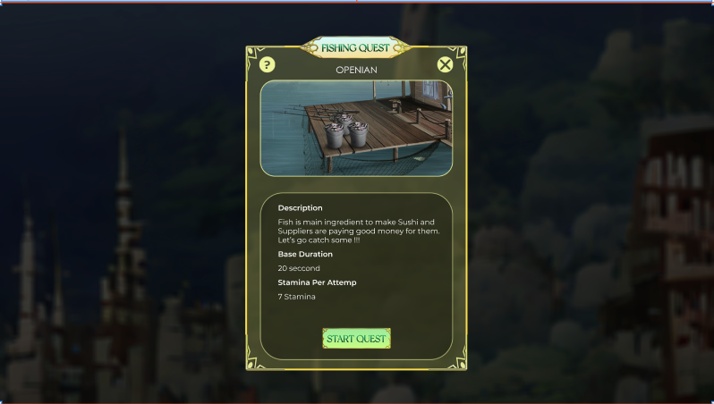
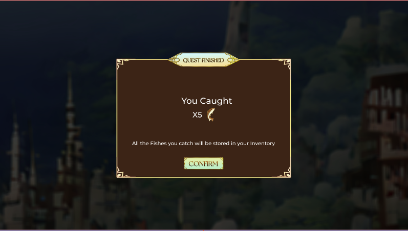
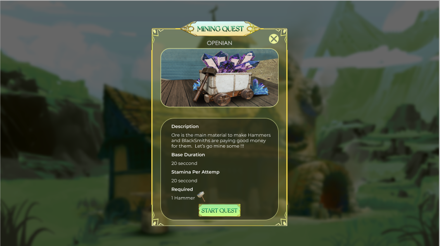
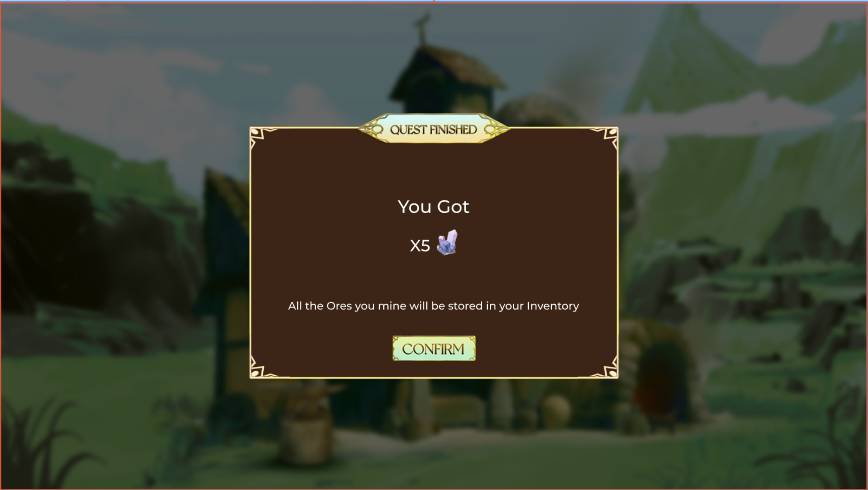

# Openian

**Activation condition**

* Must have an Openian NFT
* Description: Openian has two skills: Fishing and Mining

.png>)

**How to Fish?**

* Waiting time: 12 hours
* Required stamina: 50
* Reward: 1 Fish per playing time
* Openian can sell fish they caught at Food Court

**How to mine Ore?**

* Waiting time: 12 hours
* Required stamina: 50
* Required item: 1 Hammer / playing time
* Reward: 1 Ore / playing time
* Openian can sell the Ore they get at Workshop

It is the user interface for item exchange

.png)


[Broken link](broken-reference)

