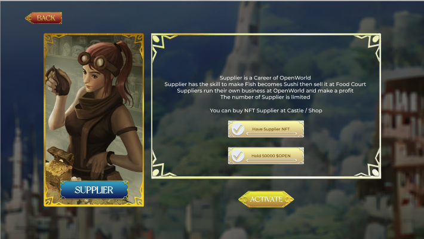
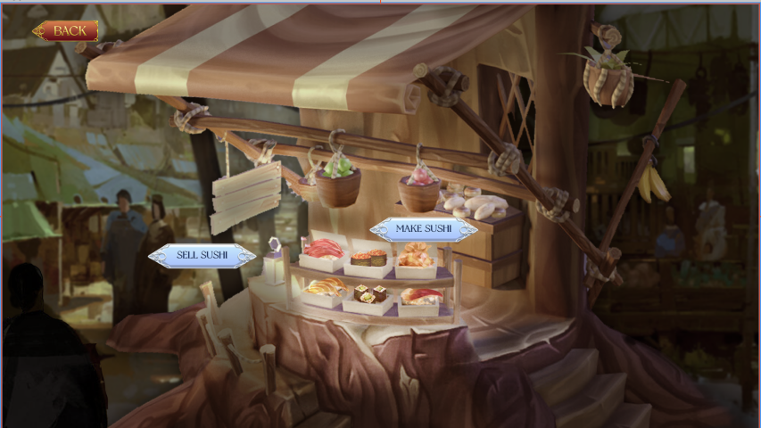
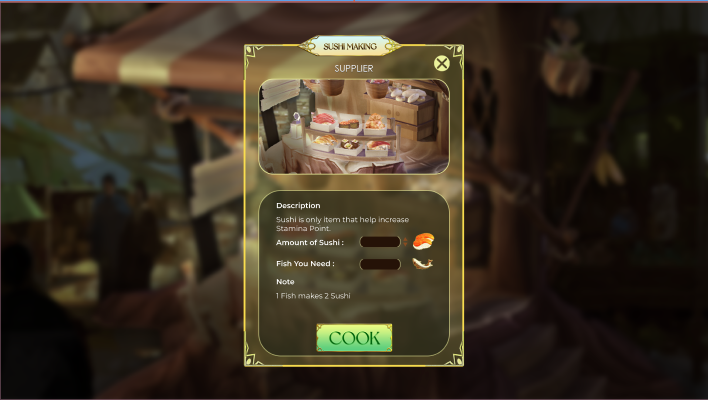
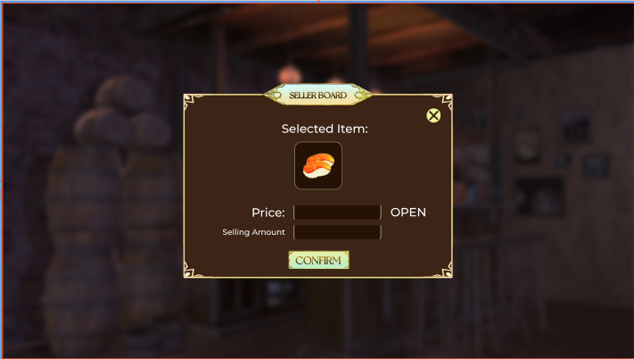

# Supplier

**Activation condition:**

* Own a Supplier NFT
* Have a wallet with ≥ 50.000 OPEN
* Description: Supplier has skills to make Sushi from Fish

**How to make Sushi?**

A Supplier can make 2 Sushi from each Fish which can be bought from Openian via Food Court

* Waiting time: 0
* Required Stamina: 50
* Tax: 5%

**What is Sushi?**

* Sushi is the item used for Stamina Recovery of Avatar. 1 Sushi helps to recover 50 Stamina points.
* Additionally, Supplier can sell their Sushis at Food Court

