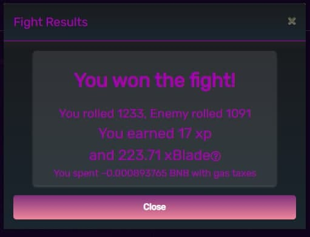

# Rewards

As soon as players vanquish their enemy successfully, they will be awarded OPEN and character experience. While character experience gained from the enemy is fixed and awarded only to the characters that defeated them, the OPEN is contingent on the power of the enemy. For the time being, the formula is 0.111627 (awarded as a gas offset) + .014651 per 1000 power of the enemy defeated.

The OPEN and experience acquired are stockpiled in preparation for players’ in-game transactions in order that the OPEN will be transferred to player’s wallet and character experience will be added to players’ character. This feature has been optimized to make cutbacks in the amount of gas required to join in the game.

Please note that the game will withdraw the OPEN from players’ storage prior to drawing OPEN from their wallet while forging.
