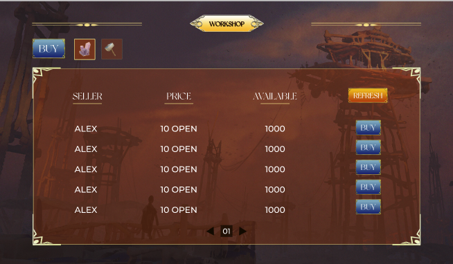
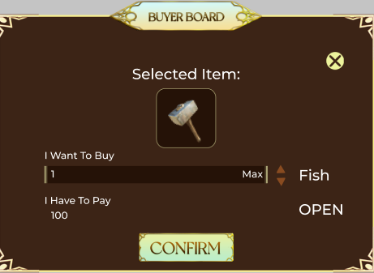
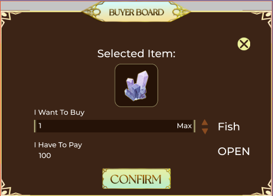

# WorkShop

At Workshop, there are two item tabs for user to choose from

For instance, there are Hammers which are provided by BlackSmith

Selling information:

* Seller: Seller information
* Price : Cost / item
* Available : available items for purchasing

Another example is Ores provided by Openian

