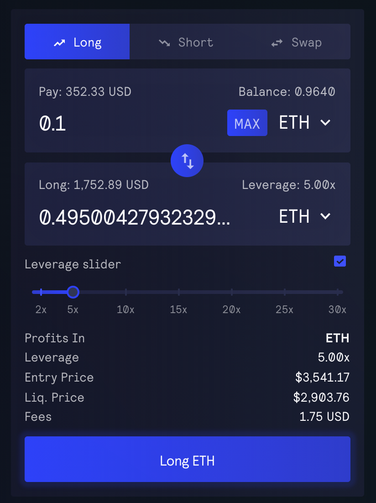
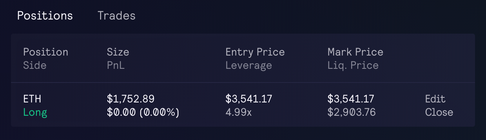

# Trading

If you do not have a wallet yet, you can use MetaMask: [https://metamask.io/download.html](https://metamask.io/download.html)

## **Connecting your wallet**

After you have a wallet, you can connect your wallet by pressing the "Connect Wallet" button on the OpenWorld Trade page: [https://app.openworld.vision/#/trade](https://app.openworld.vision/#/trade)

<figure><figcaption></figcaption></figure>

If you see the message below, click on "Add Arbitrum" or "Add Avalanche" to add the Arbitrum / Avalanche network to your wallet.

<figure><figcaption></figcaption></figure>

Alternatively, you can manually add the Arbitrum network: [https://arbitrum.io/bridge-tutorial/](https://arbitrum.io/bridge-tutorial/).

For the Avalanche network: [https://support.avax.network/en/articles/4626956-how-do-i-set-up-metamask-on-avalanche](https://support.avax.network/en/articles/4626956-how-do-i-set-up-metamask-on-avalanche).

## Backup RPC URLs

Since OpenWorld is a decentralized exchange, querying of data and submitting of transactions go through an RPC URL.&#x20;

There may be times when the RPC URL is not as responsive as it should be, during these times you may notice data being slow to load or not loading on your page. It is also possible to hit the rate limit with the public Arbitrum RPC URL ([https://arb1.arbitrum.io/rpc](https://arb1.arbitrum.io/rpc)), which would result in 429 errors.

To continue using the exchange during these times you can use a backup URL from [Alchemy](https://www.alchemy.com/), [Ankr](https://www.ankr.com/protocol/public/) or [QuickNode](https://www.quicknode.com/chains/arb), switch the RPC URL in the network settings of your wallet and the page should load faster after.

For a list of RPC URLs and their statuses: [https://chainlist.org/](https://chainlist.org/).

### Steps to change the RPC URL in MetaMask

* Click on the MetaMask icon, then click on the three-dot icon and select Expand View
* Click on your account icon on the top right and select Settings
* Click on Networks
* Key in the New RPC URL
* Click Save

## **Sending tokens**

You will need to have ETH in your Arbitrum account or AVAX in your Avalanche account to start trading.&#x20;

You can buy ETH directly on Arbitrum using Banxa: [https://openworld.banxa.com](https://openworld.banxa.com).

Alternatively, if you have ETH or AVAX on other networks you can transfer ETH to Arbitrum.

The transfer will take a few minutes, you will also be able to transfer out within a few minutes as well if you use any of the below options.

* [AnySwap](https://anyswap.exchange/bridge#/bridge)
* [Hop.Exchange](https://app.hop.exchange/send?token=USDC\&sourceNetwork=ethereum\&destNetwork=arbitrum)
* [Synapse](https://synapseprotocol.com/?inputCurrency=ETH\&outputCurrency=ETH\&outputChain=42161)

For Avalanche, you can additionally use the bridge at [https://bridge.avax.network/](https://bridge.avax.network/), or purchase [USDC](https://www.circle.com/en/usdc) directly on Avalanche.

## **Swaps**

OpenWorld supports both swaps and leverage trading. For swaps, click on the "Swap" tab on [https://app.openworld.vision/#/trade](https://app.openworld.vision/#/trade), this will open the interface to swap tokens with zero price impact.

For leverage trading, please see the below sections for more information.

## **Opening a position**

Click on "Long" or "Short" depending on which side you would like to open a leverage position on.&#x20;

* Long position
  * Earns a profit if the token's price goes up
  * Makes a loss if the token's price goes down
* Short position
  * Earns a profit if the token's price goes down
  * Makes a loss if the token's price goes up

After selecting your side, key in the amount you want to pay and the leverage you want to use, in the below example 0.1 ETH worth 352.33 USD is being used to buy a 5x ETH (Ethereum) long position of size 1752.89 USD

<figure><figcaption></figcaption></figure>

The "Entry Price" is $3541.17 and the Liquidation Price is $2903.76. Below the swap box you would also see the "Exit Price", which is the price that would be used to calculate profits if you open and then immediately close a position. The exit price will change with the price of the token you are longing or shorting.

The trading fee to open a position is 0.1% of the position size, similarly there is a 0.1% fee when closing the position.

There is also a "Borrow Fee" that is deducted at the start of every hour. This is the fee paid to the counter-party of your trade. The fee per hour will vary based on utilization, it is calculated as (assets borrowed) / (total assets in pool) \* 0.01%. The "Borrow Fee" for longing or shorting is shown below the swap box.

While there are no price impacts for trades, there can be slippage due to price movements between when your trade transaction is submitted and when it is confirmed on the blockchain. Slippage is the difference between the expected price of the trade and the execution price, this can be customised by clicking on the "..." icon next to your address at the top right of the page.

## Managing Positions

<figure><figcaption></figcaption></figure>

After opening a trade, you would be able to view it under your Positions list, you can also click on "Edit" to deposit or withdraw collateral, this allows you to manage your leverage and liquidation price.

When you open a position or deposit collateral, a snapshot of the USD price of your collateral is taken, so e.g. if your collateral is 0.1 ETH and the price of ETH is 3523.30 at the time, then your collateral is 352.33 USD and will not change even if the price of ETH changes.

The amount of profit and loss you make will be proportional to your position size. In this example, 352.33 USD has been used to buy 1752.89 USD of ETH. If the price of ETH increases by 10%, the position would have a profit of 175.29 USD, if the price of ETH decreases by 10%, the position would have a loss of 175.29 USD.

If a short position was opened instead, then if the price of ETH decreased by 10% the position would have a profit of 175.29 USD, if the price of ETH increased by 10%, the position would have a loss of 175.29 USD.

Leverage for a position is displayed as (position size) / (position collateral). If you'd like to display the leverage as (position size + PnL) / (position collateral), you can customise this by clicking on the "..." button next to your address.

Note that when depositing collateral into a long position, there is a 0.3% swap fee for the conversion of the asset to its USD value, e.g. ETH amount to USD value. This is to prevent deposits from being used as a zero fee swap. This does not apply to shorts. Withdrawing of collateral from longs and shorts do not have this fee as well.

## **Closing a Position**

You can close a position partially or completely by clicking on the "Close" button.

For long positions, profits are paid in the asset you are longing, e.g. if you long ETH you would get your profits as ETH.

For short positions, profits will be paid out in the same stablecoin that you used to open the position, e.g. USDC or USDT.

Note that [arbiscan](https://arbiscan.io/) may not always show ETH transfers so when you close long positions on Arbitrum and receive ETH the transaction might not show the transfer but your ETH balance would have increased. If the ETH transfer does show, it would be displayed under the "Interacted With" section:

<figure><figcaption></figcaption></figure>

## Stop-Loss / Take-Profit Orders

You can also set stop-loss and take-profit orders by clicking on the "Close" button and selecting the "Trigger" tab.

After creating a trigger order, it will appear in your position's row as well as under the "Orders" tab, you can edit it the order and change the trigger price if needed.&#x20;

If you close a position manually, the associated trigger orders will remain open, you would need to cancel them manually if you do not want the order to be active when opening future positions.

Note that orders are not guaranteed to execute, this can occur in a few situations including but not exclusive to:

* The mark price which is an aggregate of exchange prices did not reach the specified price
* The specified price was reached but not long enough for it to be executed
* No keeper picked up the order for execution

Additionally, trigger orders are market orders and are not guaranteed to execute at the trigger price.

<figure><figcaption></figcaption></figure>

## **Partial Liquidations**

In the example, since only 352.33 USD worth of tokens is used as collateral to open the position, there will be a price at which the loss amount is very close to the collateral amount.

This is the Liquidation Price and is calculated as the price at which the (collateral - losses - borrow fee) is less than 1% of your position's size. If the token's price crosses this point then the position will be automatically closed.

Due to the borrow fee your liquidation price will change over time, especially if you use a leverage that is more than 10x and have the position open for more than a few days, so it is important to monitor your liquidation price.

If there is any collateral remaining after deducting losses and fees, then the corresponding amount would be returned to your account.

## **Pricing**

There is no price impact for trades on OpenWorld, so you can execute large trades exactly at the mark price. During times of high volatility there will be a spread from the Chainlink price to the median price of reference exchanges.

<figure><figcaption></figcaption></figure>

The mark prices are displayed next to the market name, long positions will be opened at the higher price and closed at the lower price while short positions will be opened at the lower price and closed at the higher price.

The chart will indicate the average of the two mark prices.

## Fees

The cost to open / close a position is 0.1% of the position size.

The collateral of long positions is the token being longed, for ETH longs the collateral is ETH and for BTC longs the collateral is WBTC, etc. The collateral of shorts positions is any of the supported stablecoins e.g. USDC, USDT, DAI, FRAX. If a swap is needed when opening or closing a position then the regular swap fee would apply, this fee is 0.2% to 0.8% of the collateral size, the exact fee depends on whether the swap improves balance or reduces it.

There is also an [execution fee](trading.md#execution-fee) detailed below which is used to pay for the blockchain network costs.

## Execution Fee

There are two transactions involved in opening / closing / editing a position:

1. User sends the first transaction to request open / close / deposit collateral / withdraw collateral
2. Keepers observe the blockchain for these requests then execute them

The cost of the second transaction is displayed in the confirmation box as the "Execution Fee". This network cost is paid to the blockchain network.
