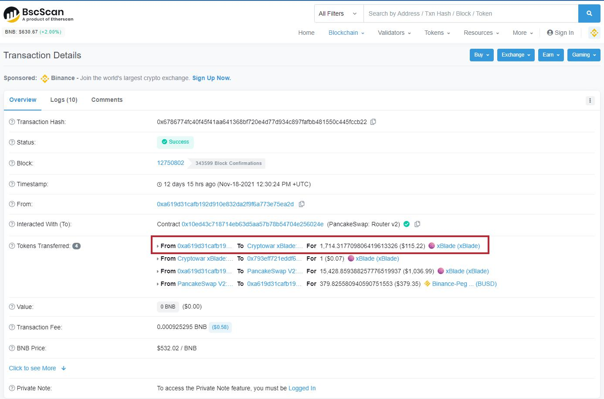

# Sales Tax

What are purposes of sales tax ?

1. Against arbitraging bot
2. Against Front-running bot

How sales tax will be used ?

1. 25% to Reward pool ( both PvE and PvP ).
2. 25% to Burn mechanism
3. 25% to Dev fund to build new features in the future
4. 25% to Marketing fund to promote CryptoWar project

